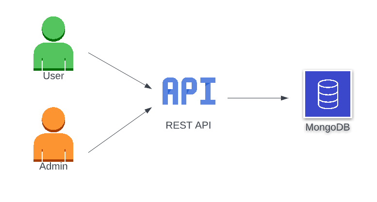

# Backend REST API
Repositori ini adalah repositori dari backend untuk REST API user dan admin. Arsitektur dari aplikasi yang ada pada repositori ini digambarkan pada gambar berikut.



## Pre-requisites
Untuk menjalankan aplikasi ini, diperlukan Docker yang sudah terinstal. Sedangkan untuk melakukan tes terhadap endpoint API disarankan menggunakan Postman.

## Menjalankan Aplikasi
1. Clone repositori ini.
2. Pindah ke direktori `backend-rest-api`.
3. Rename file `./.env.sample` dan `./rest-api/app/.env.sample` menjadi `.env`
4. Pastikan Docker sudah running. Buka terminal/command line dan jalankan perintah berikut.
```
docker-compose up
```
5. Setelah selesai dijalankan, buka dokumentasi API pada [link](https://documenter.getpostman.com/view/13125907/VUqrPHb1) berikut. Kemudian, lakukan tes endpoint dengan import collection menggunakan tombol `Run in Postman`. Credential admin yang dapat digunakan untuk melakukan login adalah sebagai berikut.
```
username: adminsatu
password: admin
```
## Catatan
Direktori `kubernetes` berisi file untuk melakukan deployment. Namun, tahap tersebut belum selesai karena terdapat beberapa error sehingga belum bisa dijalankan menggunakan Kubernetes.

## Referensi
- https://www.freecodecamp.org/news/build-a-restful-api-using-node-express-and-mongodb/
- https://mfikri.com/artikel/restful-api-express-mongodb
- https://www.bezkoder.com/node-js-mongodb-auth-jwt/
- https://www.bezkoder.com/docker-compose-nodejs-mongodb/
- https://shantanoo-desai.github.io/posts/technology/seeding-mongodb-docker-compose/
- https://codefresh.io/docs/docs/yaml-examples/examples/import-data-to-mongodb/
- https://stackoverflow.com/questions/48178870/import-data-on-mongodb-using-docker-compose
- https://kubernetes.io/docs/home/
- https://www.middlewareinventory.com/blog/deploy-docker-image-to-kubernetes/
- https://kubernetes.io/docs/concepts/workloads/controllers/deployment/
- https://kubernetes.io/docs/concepts/workloads/controllers/statefulset/
- https://kubernetes.io/docs/concepts/workloads/controllers/job/
- https://kubernetes.io/docs/concepts/services-networking/service/